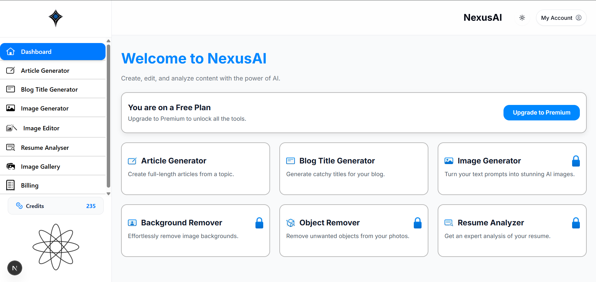
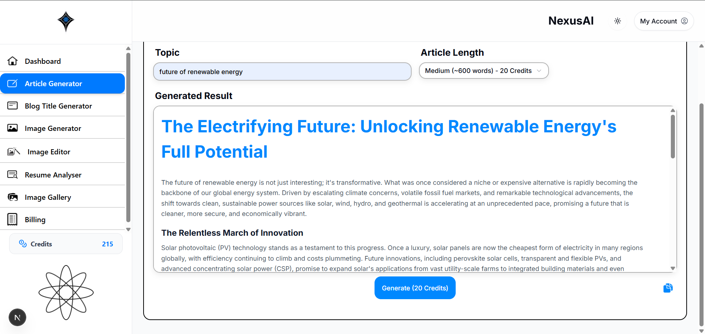
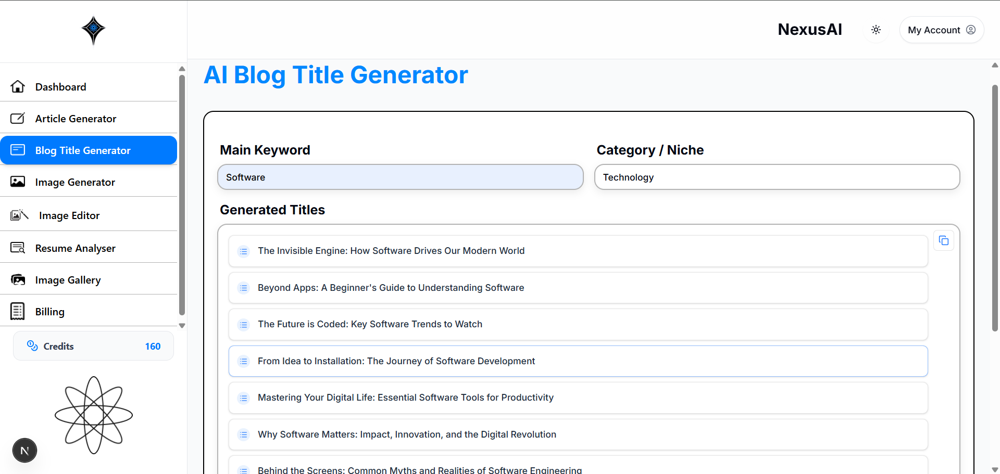
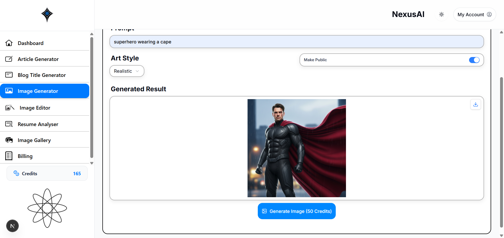
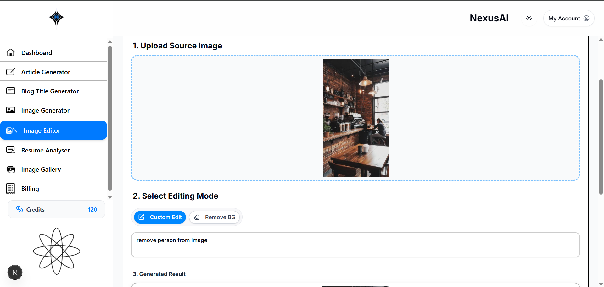
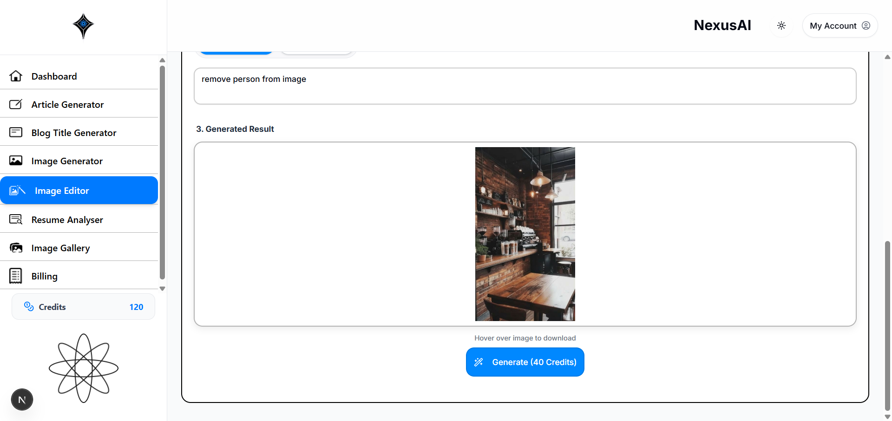
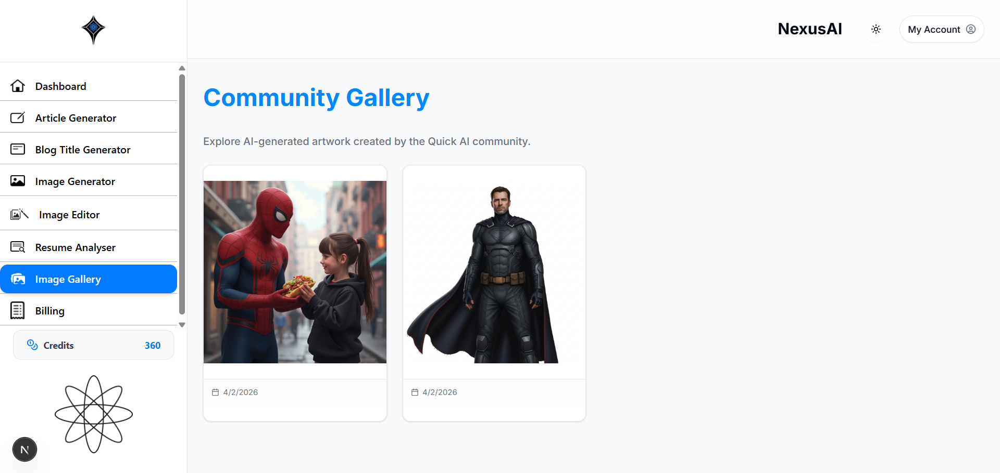
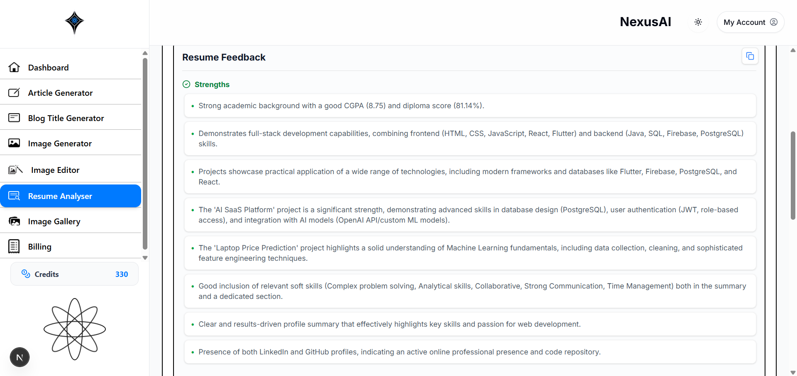

# 🚀 NexusAI - AI SaaS Platform

## 📌 Overview

**NexusAI** is a full-stack AI-powered SaaS platform that provides multiple intelligent tools for content creation, image generation, and productivity enhancement — all in one unified dashboard.

The platform is designed to simulate a real-world AI subscription-based product with features like credit usage, pricing plans, and user authentication.

---

## 🎯 Key Features

### ✍️ Content Generation

* AI Article Generator (custom topics & length)
* Blog Title Generator with keyword input

### 🎨 Image Tools

* AI Image Generator (prompt-based generation)
* Image Editor (object removal, background removal)
* Community Image Gallery

### 📄 Resume Analysis

* Upload resume and get AI-based feedback
* Highlights strengths, skills, and improvements

### 💳 SaaS Features

* Credit-based usage system
* Pricing plans (Free, Pro, Enterprise)
* Upgrade system simulation

### 🔐 Authentication

* User login/signup system
* Google Sign-In integration

---

## 🛠️ Tech Stack

| Layer    | Technology Used             |
| -------- | --------------------------- |
| Frontend | React.js, Tailwind CSS      |
| Backend  | Node.js, Express.js         |
| Database | PostgreSQL                  |
| AI APIs  | OpenAI API / Custom AI APIs |
| Auth     | JWT + OAuth (Google)        |

---

## 📂 Project Structure

```
NexusAI/
│── frontend/
│── backend/
│── screenshots/
│── README.md
│── package.json
│── .gitignore
```

---

## ⚙️ Installation & Setup

### 1️⃣ Clone the Repository

```bash
git clone https://github.com/your-username/nexusai.git
cd nexusai
```

### 2️⃣ Install Dependencies

#### Backend

```bash
cd backend
npm install
```

#### Frontend

```bash
cd frontend
npm install
```

---

### 3️⃣ Setup Environment Variables

Create `.env` file in backend:

```env
PORT=5000
DATABASE_URL=your_postgresql_url
JWT_SECRET=your_secret
OPENAI_API_KEY=your_api_key
GOOGLE_CLIENT_ID=your_google_client_id
```

---

### 4️⃣ Run the Project

#### Backend

```bash
npm node server.js
```

#### Frontend

```bash
npm run dev
```

---

## 📸 Screenshots

### 🏠 Landing Page


### 🔐 Login Page


### 📊 Dashboard



### ✍️ Article Generator



### 🧠 Blog Title Generator



### 🎨 Image Generator



### 🖼️ Image Editor




### 🖼️ Gallery



### 📄 Resume Analyzer



### 💳 Pricing Plans


---

## 💡 Unique Selling Points

* All-in-one AI tool platform (SaaS model)
* Credit-based monetization system
* Multiple AI integrations in a single UI
* Real-world product simulation (like ChatGPT + Canva combo)

---

## 🚀 Future Enhancements

* Payment gateway integration (Razorpay/Stripe)
* Real-time AI streaming responses
* Team collaboration features
* Advanced analytics dashboard

---

## 👨‍💻 Author

**Vishwajit Deshmukh**

---

## 📜 License

This project is developed for educational purposes (Final Year Project).

---

## ⭐ Acknowledgment

Special thanks to mentors and open-source tools that supported this project.
